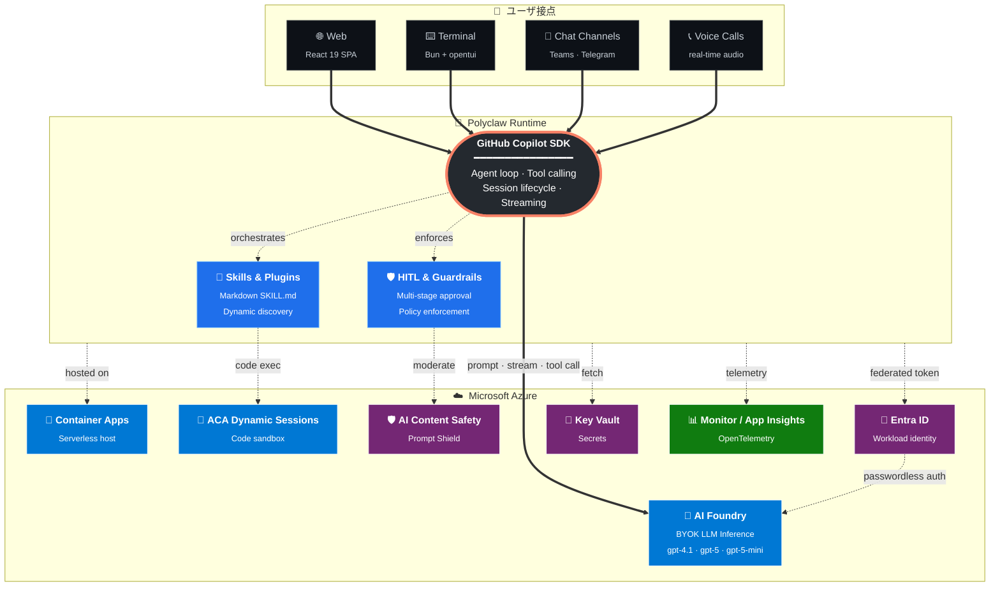
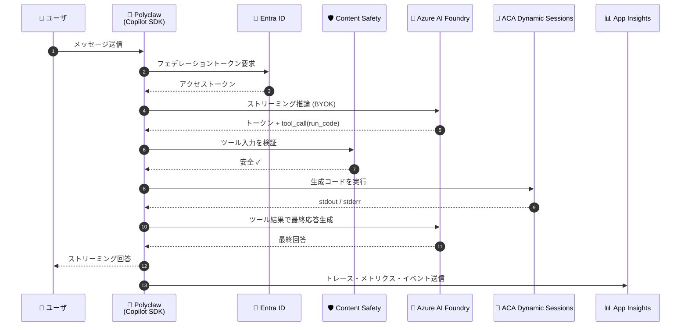

<p align="center">
  
</p>

<h1 align="center">Polyclaw-jp</h1>

<p align="center">
  <strong>あなたが居る場所で動く、自律型 AI コパイロット — ブラウザ・ターミナル・メッセージアプリ・電話まで。</strong>
</p>

<p align="center">
  <a href="https://github.com/shinyay/polyclaw-jp/actions/workflows/ci.yml"></a>
  <a href="https://www.python.org/downloads/"></a>
  <a href="https://nodejs.org/"></a>
  <a href="https://github.com/features/copilot"></a>
  <a href="https://azure.microsoft.com/products/ai-foundry"></a>
  <a href="Dockerfile"></a>
  <a href="LICENSE"></a>
</p>

---

## Polyclaw-jp とは

**Polyclaw-jp** は、GitHub Copilot SDK を中核に据え、Microsoft Azure 上に構築された **自律型 AI コパイロット** です。IDE を離れて、ブラウザ・ターミナル・チャットアプリ・電話などあらゆる場所であなたと協働します。スキルを動的に書き換えながら自己拡張し、必要なときには自分から連絡してきて、スケジュールされたタスクを淡々とこなします。

> [!WARNING]
> Polyclaw-jp は **自律的に動作するエージェント** です。コードの実行、インフラのデプロイ、他者へのメッセージ送信、電話発信などを行います。エージェントランタイムは管理プレーンとアーキテクチャ的に分離され、**専用の Azure Managed Identity** で最小権限の RBAC のもと動作します — あなたの個人 Azure 認証情報は共有しません。それでも実行前に [リスク](https://aymenfurter.github.io/polyclaw/responsible-ai/) を理解してください。

---

## なぜ Polyclaw-jp か

**🧩 自己拡張可能** — 新しいスキルを依頼すると、Polyclaw がその場で Markdown でスキルを書き、保存し、即座に利用を開始します。再デプロイ不要。

**📣 プロアクティブ** — スケジュールしたチェックが失敗したとき、リマインダが発火したとき、あなたが定義した条件が満たされたとき — 接続済みのチャネル経由でこちらから連絡します。

**🗓️ スケジュール対応** — cron ジョブとワンショットタスクで Polyclaw が先を読んで動きます。毎朝のブリーフィング、定期的な Web スクレイピング、未来のリマインダ — すべて自律処理されます。

**📞 音声通話** — 本当に緊急の用件のときは、Azure Communication Services と Azure OpenAI Realtime 経由で、ライブ会話としてあなたに電話をかけます。

**🔌 拡張可能** — MCP サーバを追加、プラグインパックを投入、Markdown でスキルファイルを記述。すべてダッシュボードから設定できます。**Microsoft Work IQ** (Microsoft 365 の生産性データを使った日次ロールオーバーや週次/月次レビュー) と **Microsoft Foundry Agents** (Foundry リソース・モデル・コード実行可能エージェントの構築) がビルトイン同梱。

**🛡️ ガードレール & HITL** — ツール呼び出しごとに防御層が介在し、設定可能な緩和戦略 — 許可 / 拒否 / Human-in-the-Loop (チャットまたは電話) / AI-in-the-Loop (2 つ目のモデルが審査) / Azure AI Prompt Shields によるコンテンツフィルタリング — を適用します。プリセットポリシー (寛容 / バランス / 制限) とツール単位のルールで細やかに制御できます。

**🔐 エージェント ID** — エージェントランタイムは独自の Azure Managed Identity (Docker 環境ではサービスプリンシパル) で動作。あなたの個人 CLI セッションを共有することはなく、管理プレーンとランタイムは独立した認証スコープで完全分離されています。

**📊 ツールアクティビティ監査** — ツール呼び出しごとに自動リスクスコアリング・Prompt Shield 結果・セッション分解・手動フラグ・CSV エクスポートを行うエンタープライズ監査ダッシュボード。すべてのツール呼び出しに自動でリスクスコアが付与されます。

**🔭 モニタリング** — Application Insights と Log Analytics をワンクリックでプロビジョニング。OpenTelemetry トレース・メトリクス・ログがランタイムから Azure Monitor へ。サンプリング設定とライブメトリクスもオプション対応。

**🧠 メモリシステム** — 会話はアイドル期間後に自動的に長期メモリに統合されます。日次トピックノートとメモリログがセッション横断の知識ベースを構築。**Foundry IQ** を有効化すれば、メモリを Azure AI Search にインデックスし、意味検索で過去の文脈を呼び戻せます。

**🗂️ 永続的ワークスペース** — セッションをまたいで存続する専用ホームディレクトリ — ファイル・データベース・スクリプト、そして Web を自律ナビゲートする組み込み Playwright ブラウザを完備。

---

## アーキテクチャ

Polyclaw-jp は **GitHub Copilot SDK** をエージェントの要石とし、**Microsoft Azure** を本番グレードの基盤 — 推論・ホスティング・サンドボックス・セキュリティ・ID・シークレット・可観測性のすべて — として利用します。



### プロンプトが流れる仕組み



### Azure 機能マトリクス

| Azure サービス | Polyclaw での役割 | なぜ重要か |
|---|---|---|
| **🧠 AI Foundry** | Copilot SDK の BYOK プロバイダフック経由で LLM 推論 | 自テナント内でエンタープライズグレードのモデルを利用 |
| **🚀 Container Apps** | Polyclaw ランタイムをサーバレスでホスト | スケールゼロ、リビジョン管理デプロイ、Ingress 統合 |
| **🧪 ACA Dynamic Sessions** | エージェント生成コード実行用の per-request サンドボックス | 信頼できないコードがランタイムコンテナに触れない |
| **🛡️ AI Content Safety** | ツール呼び出し前段の Prompt Shield | ジェイルブレイクプロンプトをモデル到達前に阻止 |
| **🔐 Microsoft Entra ID** | ランタイム → Foundry のワークロード ID | API キー不要、トークンは自動回転 |
| **🔑 Key Vault** | `@kv:` プレフィックスで任意の設定値を解決 | シークレットの単一源泉 |
| **📊 Monitor / App Insights** | エージェント 1 ターン単位の OpenTelemetry トレース | ツール呼び出し・レイテンシ・エラーまで完全可視化 |

---

## デモ動画とスクリーンショット

### イントロ動画

<p align="center">

https://github.com/user-attachments/assets/c218bd9d-b313-40d7-8e9f-6081a62b3de2

</p>

### Web ダッシュボード

<p align="center">
  
</p>

### ターミナル UI

<p align="center">
  
</p>

### メッセージング (Telegram Bot 経由)

<p align="center">
  
</p>

---

## Polyclaw-jp の独自改良

このリポジトリ (`shinyay/polyclaw-jp`) は、日本での利用を意識して以下の独自改良を施しています。

### 🇯🇵 日本での利用を想定した README

完全日本語版 README とドキュメントの整備を進めています。チャット応答はもともと日本語で自然に動作します (UI ラベルは現状英語のまま — 日本語化は今後対応予定)。

### 🧠 Foundry に複数モデル展開対応 (PR-B)

upstream では `DEPLOYED_MODELS` 環境変数を `/data/.env` ファイル限定で読んでいたため、Azure Container Apps のような **環境変数で設定する本番環境** では複数モデル切替ができませんでした。本 fork では `os.getenv` フォールバックを追加し、ACA 上でも UI のモデルピッカーに **gpt-4.1 / gpt-5 / gpt-5-mini** すべてが表示されるよう修正しています ([詳細](app/runtime/agent/agent.py))。

### 🚀 ワンコマンド Azure デプロイ

`scripts/deploy-aca.sh` と `scripts/destroy-aca.sh` で、Azure へのデプロイとクリーンアップを完全自動化しました。

| スクリプト | 役割 |
|---|---|
| `scripts/deploy-aca.sh` | Resource Group / ACR / Container Apps / AI Foundry / Key Vault / Monitor を **8 ステップ** で一括プロビジョニングし、RBAC まで自動設定 |
| `scripts/destroy-aca.sh` | RG 削除 + Key Vault / Foundry の **soft-delete purge** まで実施し、リソースを完全消去 |

詳細は後述の [クイックスタート](#-クイックスタート-azure-へデプロイ) を参照してください。

### 📚 詳細な内部分析ドキュメント

開発過程で蓄積したアーキテクチャ詳細分析や設計判断の記録があります。将来的に `docs/` 配下へ整備予定です。

---

## 🚀 クイックスタート (Azure へデプロイ)

Azure アカウントがあれば **ワンコマンド** で Polyclaw-jp を本番ホスティングできます。

### 前提条件

- Azure CLI 2.x (`az login` 済み)
- 任意の Azure サブスクリプション (BYOK で LLM 推論を行うため)
- 5-10 分の待ち時間 (リソース作成のため)

### デプロイ

```bash
# Polyclaw-jp を clone
git clone https://github.com/shinyay/polyclaw-jp.git
cd polyclaw-jp

# Azure に admin (ローカル) + runtime (ACA) を一括デプロイ
# 全 RBAC は自動付与されます
./scripts/deploy-aca.sh
```

スクリプトが実行する内容:

1. Resource Group を作成
2. Azure Container Registry (ACR) を作成し、イメージを build & push
3. Azure AI Foundry リソースを作成し、`gpt-4.1` / `gpt-5` / `gpt-5-mini` を deploy
4. Key Vault を作成し、シークレットを格納
5. Container Apps Environment と App を作成
6. RBAC を自動付与 (Cognitive Services OpenAI User など)
7. ヘルスチェックで起動確認
8. 接続情報を表示

### 削除

```bash
# Resource Group を丸ごと削除 + Key Vault / Foundry を purge
./scripts/destroy-aca.sh
```

> [!NOTE]
> 削除は約 23 分かかります (Azure 側の soft-delete purge を待つため)。

---

## ローカル開発

すべてを Docker Compose でローカル起動することもできます。

```bash
# ビルド & 起動
docker compose up -d --build

# ブラウザで開く
open http://localhost:9090
```

初回起動時はセットアップウィザードに従って:

1. GitHub の OAuth で Copilot を認証 (BYOK 不使用時)
2. Foundry を使う場合は Azure 接続を構成
3. メッセージングチャネル (Teams / Telegram) や音声 (ACS) はオプション

---

## 前提条件

| カテゴリ | 必須 / 推奨 | 内容 |
|---|---|---|
| 言語 | 必須 | Python 3.11+, Node.js 20+ |
| コンテナ | 必須 | Docker / Docker Compose |
| Azure | デプロイ時必須 | Azure CLI 2.x, 任意の Subscription |
| GitHub | 推奨 | GitHub CLI (`gh`) |
| その他 | オプション | Cloudflare Tunnel CLI (公開時), ACS リソース (電話機能時) |

---

## 日本語環境での利用例

Polyclaw-jp は **チャットの入出力はもともと日本語に対応** しています。以下はよく使う対話例です。

### 自然な日本語チャット

```
👤 自己紹介して
🐾 Polyclaw です。あなたの自律型 AI コパイロットとして...
```

### スラッシュコマンド (5 モード)

Web チャット UI 左下のモード切替で、特定スキルを直接呼び出せます。

| モード | 用途 | 日本語入力例 |
|---|---|---|
| `チャット` | 通常の対話・タスク依頼 | 「明日のミーティング準備を手伝って」 |
| `/note` | メモを長期メモリに保存 | 「明日 15:00 のクライアントミーティング準備をメモして」 |
| `/summarize` | URL や長文を要約 | 「https://example.com/article を 3 行で要約して」 |
| `/search` | Web 検索 (Playwright で実ブラウザ実行) | 「最新の Azure AI Foundry のニュースを検索」 |
| `/brief` | 蓄積メモリの集約サマリ | 「今週のメモを総括して」 |

### モデルの切り替え

Foundry に複数のモデルが展開されている場合、チャット中に `/model` でいつでも切替可能です。

```
👤 /model gpt-5
🐾 モデルを gpt-5 に切り替えました。
```

> [!TIP]
> UI ラベルは現状英語のままですが、エージェントとの会話は完全に日本語で行えます。UI 自体の日本語化は今後のロードマップで検討中です。

---

## セキュリティ・ガバナンス・Responsible AI

### リスクの理解

Polyclaw-jp は **自律エージェント** であり、コード実行・インフラ操作・他者への発信・電話発信を行います。許可した範囲で **本物のお金が動く** 可能性 (Azure リソースの作成・他サービス API の呼び出しなど) があります。実運用前に [Responsible AI ガイダンス](https://aymenfurter.github.io/polyclaw/responsible-ai/) を確認してください。

### 実装済みのセキュリティ機能

- **管理プレーンとランタイムの分離** — 別コンテナ・別認証スコープで完全分離
- **専用 Managed Identity** — ランタイムは独立した RBAC 最小権限で動作
- **多層 HITL** — 4 段階の防御 (Prompt Shield / AITL / Phone Verify / User Approval)
- **Azure AI Prompt Shields** — ジェイルブレイク・プロンプトインジェクション検出
- **Tool Activity 監査** — すべてのツール呼び出しのリスクスコアリングと CSV エクスポート
- **設定可能なガードレールポリシー** — 寛容 / バランス / 制限 のプリセット + ツール単位ルール
- **Cloudflare Tunnel 経由の公開時のみ tunnel-restriction middleware** で対象ルートを制限
- **シークレット管理** — 環境変数 + `@kv:` プレフィックスによる Key Vault 透過参照
- **OpenTelemetry トレース** — エージェント 1 ターン単位の完全可視化

### まだ実装されていない / 不足している領域

- 包括的なレッドチームテスト
- すべての悪意あるツール組み合わせに対する厳格なポリシー証明
- マルチテナント分離 (現状は個人 / 小規模利用想定)
- フォーマルな SLA / SLO

### 推奨される使い方

- **個人開発 / PoC**: 推奨。Docker Compose 起動 + 既定のバランスポリシー
- **チーム内デモ**: 推奨。`deploy-aca.sh` で Azure デプロイ + Application Insights 有効化
- **本番運用**: 慎重に。レッドチーミング・モニタリング体制・インシデント対応プロセスを整備した上で

---

## 今後の方針 (ロードマップ)

Polyclaw-jp の今後の改善方向です。各項目は GitHub Issue で議論しています。

### 短期 — Foundry deployment list の動的取得 ([#1](https://github.com/shinyay/polyclaw-jp/issues/1))

現状は `DEPLOYED_MODELS` 環境変数でモデル一覧を渡していますが、Azure deployment API から **動的に取得** する方式へ置き換えます。これにより、Foundry でモデルを deploy した直後に再起動なしで UI に反映されます。

### 中期 — polyclaw UI からモデル展開管理 ([#2](https://github.com/shinyay/polyclaw-jp/issues/2))

Setup Wizard を拡張し、ブラウザ UI から **Foundry へのモデル deploy / 削除** を行えるようにします。Bicep deployer をベースに、新モデル追加→即利用開始までを Web で完結できます。

### 長期 — BYOK ⇔ Copilot CLI モデルの hybrid 化 ([#3](https://github.com/shinyay/polyclaw-jp/issues/3))

現在は Foundry BYOK と GitHub Copilot CLI 互換モデル (`claude-sonnet-4.6`, `gpt-5.5`, `gemini-3.1-pro-preview` 等) が **排他** です。**session 単位で切替可能** にすれば、コーディング系は Copilot CLI、機密データ処理は Foundry、といった使い分けができるようになります。

### 検討中 — UI 日本語化

現状 UI ラベルは英語ですが、日本語 UI への切替機能を検討中です。フィードバック歓迎。

---

## ライセンス

[MIT License](LICENSE)

---

## クレジット

本リポジトリは [aymenfurter/polyclaw](https://github.com/aymenfurter/polyclaw) (MIT License) を基に、日本での利用を意識した改良と日本語化を加えた fork です。original author の素晴らしい仕事に感謝します 🙏
