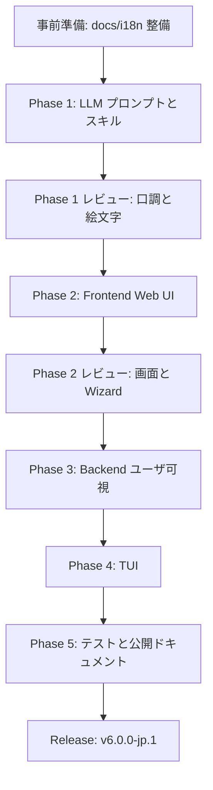

# Polyclaw 日本語化 フェーズ計画

## はじめに

本ドキュメントは、`docs/i18n/` 配下の既存文書を前提として、A 案（全面日本語化）の Phase 1〜5 を実装するための詳細ロードマップです。

- 位置付けは、`README.md`、`glossary.md`、`style-guide.md`、`test-strategy.md`、`inventory.csv` を実装順序へ落とし込む作業計画です。
- 大前提は、「ユーザに見えるものは日本語、開発者しか見ないものは英語」です。
- 上流追随戦略はハイブリッドです。
- コア層（`app/runtime/agent`、`server`、`state`）は cherry-pick しやすさを優先します。
- UI 層（`app/frontend`、`app/tui`、`templates/`、`skills/`）は日本語 UX を優先して独立運用します。
- インベントリ実測値は合計 2,396 件です。
- レイヤ別内訳は Frontend 794 件、Backend 98 件、TUI 840 件、Templates 579 件、スキル 85 件です。
- 実測のユニーク対象ファイルは 86 ファイルです。
- 実測のユニーク英文は 1,978 件です。
- 翻訳順序の原則は、LLM 応答トーン、Frontend、Backend、TUI、テスト・ドキュメントです。
- 1 Phase は複数 PR で構成します。
- PR 単位の粒度は、ファイル群、コンポーネント群、ハンドラ群のいずれかです。

> [!IMPORTANT]
> 本計画は実装時の判断基準です。用語は `glossary.md`、文体と記号は `style-guide.md`、テスト更新判断は `test-strategy.md` を優先してください。

## 目次

- [0. 全体像](#0-全体像)
- [1. Phase 1: LLM プロンプト + 人格 + スキル](#1-phase-1-llm-プロンプト--人格--スキル)
- [2. Phase 2: Frontend（Web UI）](#2-phase-2-frontendweb-ui)
- [3. Phase 3: Backend ユーザ可視メッセージ](#3-phase-3-backend-ユーザ可視メッセージ)
- [4. Phase 4: TUI](#4-phase-4-tui)
- [5. Phase 5: テスト + ドキュメント + リリース](#5-phase-5-テスト--ドキュメント--リリース)
- [6. PR レビューフロー（全 Phase 共通）](#6-pr-レビューフロー全-phase-共通)
- [7. リスクとミティゲーション（全 Phase 共通）](#7-リスクとミティゲーション全-phase-共通)
- [8. 進捗管理](#8-進捗管理)
- [9. 次のアクション](#9-次のアクション)

## 0. 全体像

### 0.1 Phase 概要表

| Phase | 内容 | インベントリ件数 | ユニークファイル | ユニーク英文 | 主要対象 | 想定 PR 数 |
|---|---|---:|---:|---:|---|---:|
| 事前準備 | `docs/i18n/` 整備 | （済） | （済） | （済） | `docs/i18n/` + `scripts/` | 1（完了） |
| Phase 1 | LLM プロンプト / 人格 / スキル | 664 | 20 | 656 | `app/runtime/templates/`、`skills/` | 5 |
| Phase 2 | Frontend（Web UI） | 794 | 26 | 611 | `app/frontend/src/` | 13 |
| Phase 3 | Backend ユーザ可視 | 98 | 16 | 80 | `app/runtime/` のユーザ可視のみ | 3 |
| Phase 4 | TUI | 840 | 24 | 657 | `app/tui/src/` | 6 |
| Phase 5 | テスト / ドキュメント / リリース | 影響全体 | 約 80+ | 該当なし | `tests/`、`docs/`、`README.md` | 6 |

### 0.2 インベントリ実測サマリー

| layer | 件数 | ユニークファイル | ユニーク英文 | 現在 status |
|---|---:|---:|---:|---|
| `frontend` | 794 | 26 | 611 | `pending` 794 件 |
| `backend` | 98 | 16 | 80 | `pending` 98 件 |
| `tui` | 840 | 24 | 657 | `pending` 840 件 |
| `template` | 579 | 16 | 575 | `pending` 579 件 |
| `skill` | 85 | 4 | 81 | `pending` 85 件 |
| **合計** | **2,396** | **86** | **1,978** | **`pending` 2,396 件** |

### 0.3 Phase 順序の根拠

- Phase 1 を最初にします。
- LLM 出力の口調を先に固定すると、後続の UI、Backend、TUI で「画面の日本語」と「LLM の日本語」が乖離しにくくなります。
- Phase 2 を Backend より先にします。
- Frontend は LLM 応答を表示する受け皿であり、ユーザが最も長く触れる面です。
- Phase 3 は Frontend 後にします。
- API レスポンスメッセージは Frontend がどのように表示するかを見てから日本語化したほうが、文言の責務がぶれにくくなります。
- Phase 4 は最後の実装 Phase にします。
- TUI 利用者はパワーユーザ層であり、Web UI より優先度を下げます。
- Phase 5 は最後にします。
- テスト期待値、スクリーンショット相当、公開ドキュメントは全 Phase の文言が固まってからまとめて整合させます。
- ただし、各 Phase 内では targeted smoke test を実施します。

### 0.4 Phase フロー

以下の図は、実装順序とフィードバックポイントを示します。



この流れにより、最初に言語体験の中心を固定し、その後に表示面、API 境界、Terminal UI、テストを安定させます。

### 0.5 並行可能性マップ

| 範囲 | 並行可否 | 条件 |
|---|---|---|
| Phase 1 `templates/` と `skills/` | 並行可能 | `system_prompt.md` の用語と口調を基準にします。 |
| Phase 1 内の小規模 template | 並行可能 | `memory_prompt.md` と `realtime_prompt.md` は相互レビューします。 |
| Phase 2 共通コンポーネント | 先行必須 | `Sidebar`、`TopBar`、`Disclaimer` を先に翻訳します。 |
| Phase 2 ページ群 | 並行可能 | `data-testid` 方針を PR-2.0 で先に固定します。 |
| Phase 3 ハンドラ群 | 並行可能 | `message` / `detail` のみ翻訳し、ログとコードは英語維持です。 |
| Phase 4 画面群 | 並行可能 | CJK 幅対応ユーティリティを PR-4.0 で先に入れます。 |
| Phase 5 Python テストと Playwright | 並行可能 | 文言の最終形が Phase 1〜4 で確定していることが条件です。 |
| Phase 5 ドキュメントとリリース | 順次 | README、Hugo docs、CONTRIBUTING、CHANGELOG、Release notes の順です。 |

### 0.6 共通ルール（全 Phase 適用）

- 1 PR は 1 論理単位にします。
- 論理単位は 1 ファイル、1 コンポーネント群、1 ハンドラ群、1 画面群のいずれかです。
- PR タイトルは英語にします。
- PR タイトルは Conventional Commits 規約に従います。
- 例: `feat(i18n): translate Chat page to Japanese`
- PR description には「対象ファイル」「glossary 準拠の用語」「テスト影響範囲」を明記します。
- レビュアーは `docs/i18n/README.md` のチェックリストを毎回確認します。
- マージ前に該当範囲の `pytest` と Playwright が pass していることを確認します。
- TUI は `bun test` または `bun run typecheck` の既存コマンドを使います。
- 各 Phase 完了時にレビュー会で総括します。
- 既存のログ、コード識別子、API key、JSON key、error code は英語維持です。
- `inventory.csv` の該当行は、翻訳作業に合わせて `proposed_ja` と `status` を更新します。

### 0.7 英語維持境界線の再確認

詳細な境界線は `docs/i18n/README.md` の「英語維持境界線」を正とします。

| 日本語化する対象 | 英語維持する対象 |
|---|---|
| UI ラベル、ボタン、トースト | 変数名、関数名、クラス名 |
| Bot 応答、Voice 応答 | 内部ログ、ログタグ |
| LLM プロンプト、スキル本文 | Python docstring、開発者コメント |
| API の human-readable `message` | API JSON key、machine-readable `code` |
| README、Hugo docs、CONTRIBUTING | Git commit message、PR title |
| Playwright の代表的な日本語 text assert | テスト名、failure diagnostic |

### 0.8 上流追随戦略

| 層 | 方針 | 理由 |
|---|---|---|
| Runtime core | cherry-pick 優先 | 本家の修正を取り込みやすくします。 |
| Server route wiring | cherry-pick 優先 | API 互換性とセキュリティ修正を維持します。 |
| State store | 原則 cherry-pick、必要最小差分 | profile / wizard 拡張は小さく保ちます。 |
| Frontend | 独立運用 | 日本語 UX と `data-testid` を優先します。 |
| TUI | 独立運用 | CJK 表示幅対応が本家と差分になります。 |
| Templates / スキル | 独立運用 | A 案の中核であり、日本語体験に直結します。 |
| Docs | 独立運用 | 日本語ユーザー向けに再構成します。 |

## 1. Phase 1: LLM プロンプト + 人格 + スキル

### 1.1 目的

- LLM の応答口調、絵文字使用、敬語レベルを日本語ポリシーに固定します。
- 人格 `Octo` を「オクト」として扱いつつ、セットアップウィザード選択方式へ拡張する素地を作ります。
- スキルの説明文を日本語化し、LLM がツール選択を日本語文脈で判断できるようにします。
- `style-guide.md` §5 の絵文字方針を `system_prompt.md` に反映します。
- Telegram MarkdownV2 と日本語表記の衝突を早期に検出します。

### 1.2 実測規模

| 対象 | 件数 | ユニークファイル | ユニーク英文 | 備考 |
|---|---:|---:|---:|---|
| `template` | 579 | 16 | 575 | すべて `app/runtime/templates/*.md` です。 |
| `skill` | 85 | 4 | 81 | すべて `skills/*/SKILL.md` です。 |
| **Phase 1 合計** | **664** | **20** | **656** | A 案の中核です。 |

### 1.3 対象ファイル: templates/

| ファイル | 実ファイル行数 | インベントリ件数 | 優先度 | 作業方針 |
|---|---:|---:|---|---|
| `app/runtime/templates/system_prompt.md` | 545 | 353 | 最高 | 口調、人格、絵文字、Telegram 規約を全面再設計します。 |
| `app/runtime/templates/memory_prompt.md` | 78 | 67 | 高 | メモリ形成の指示を日本語化します。 |
| `app/runtime/templates/realtime_prompt.md` | 49 | 33 | 高 | Realtime / Voice 応答の口調を日本語化します。 |
| `app/runtime/templates/proactive_generate_prompt.md` | 41 | 32 | 高 | プロアクティブメッセージ生成を日本語化します。 |
| `app/runtime/templates/proactive_prompt_section.md` | 42 | 32 | 高 | system prompt へ組み込まれる節として整合させます。 |
| `app/runtime/templates/bootstrap_prompt.md` | 37 | 17 | 高 | 起動プロンプトを日本語化します。 |
| `app/runtime/templates/phone_verify_prompt.md` | 15 | 12 | 中 | 電話承認の文言を自然な日本語にします。 |
| `app/runtime/templates/placeholder_soul.md` | 13 | 9 | 高 | デフォルト人格を `オクト` 基準へ調整します。 |
| `app/runtime/templates/mcp_guidance.md` | 13 | 4 | 中 | MCP ガイダンスを日本語化します。 |
| `app/runtime/templates/memory_transcript_prompt.md` | 7 | 4 | 中 | transcript 形式と日本語ラベルを決めます。 |
| `app/runtime/templates/realtime_opening_message.md` | 7 | 4 | 中 | 通話開始メッセージを日本語化します。 |
| `app/runtime/templates/sandbox_prompt.md` | 7 | 4 | 中 | サンドボックス説明を日本語化します。 |
| `app/runtime/templates/realtime_call_instructions.md` | 5 | 3 | 中 | 通話時の振る舞いを日本語化します。 |
| `app/runtime/templates/session_resume_prompt.md` | 7 | 3 | 中 | セッション再開文脈を日本語化します。 |
| `app/runtime/templates/phone_verify_opening.md` | 1 | 1 | 低 | 短文として自然な日本語にします。 |
| `app/runtime/templates/scheduler_prompt.md` | 1 | 1 | 低 | スケジュール実行指示を日本語化します。 |

### 1.4 `system_prompt.md` の重点修正

- 旧方針の「Use emoji generously」を完全に削除します。
- 新方針として、「絵文字は状態・感情・カテゴリのタグとして文頭または見出しに 1 つだけ使用してください」と明記します。
- 「文末装飾としての絵文字は使用しないでください」と明記します。
- 「ユーザに対しては常に日本語のですます調で応答してください」と明記します。
- LLM の自称は「私」に固定します。
- ユーザの呼称は原則省略し、必要時のみ「あなた」にします。
- 過度な敬語、タメ口、フランクな口調を禁止します。
- コード、識別子、ログキー、API key は英語維持でよいことを明記します。
- Telegram MarkdownV2 の特殊文字と日本語句読点の扱いを整理します。
- 既存の「Telegram regulations」は、日本語ビジネスチャット向けの規約へ再設計します。

### 1.5 対象ファイル: skills/

| ファイル | 実ファイル行数 | インベントリ件数 | 作業方針 |
|---|---:|---:|---|
| `skills/note-taking/SKILL.md` | 86 | 37 | 本文と `description` を日本語化します。 |
| `skills/daily-briefing/SKILL.md` | 50 | 18 | daily briefing の実行指示を日本語化します。 |
| `skills/summarize-url/SKILL.md` | 27 | 16 | URL 要約の出力方針を日本語化します。 |
| `skills/web-search/SKILL.md` | 25 | 14 | web search の判断文脈を日本語化します。 |

### 1.6 スキルの英語維持ルール

- YAML frontmatter の `name:` は英語維持です。
- YAML frontmatter の `metadata.verb:` は英語維持です。
- `description:` は LLM が読む説明なので日本語化します。
- Markdown 本文は日本語化します。
- コマンド名、API 名、URL、コードブロック内の識別子は英語維持です。
- skill directory 名は英語維持です。

### 1.7 PR 分割案

| PR | 対象 | 規模目安 | 依存 | 主な検証 |
|---|---|---:|---|---|
| PR-1.1 | `system_prompt.md` | 545 行、353 件 | 単独 | `pytest app/runtime/tests/test_prompt.py` |
| PR-1.2 | `placeholder_soul.md` + 人格関連 template | 約 25 件 | PR-1.1 の用語 | profile / prompt 組み立て確認 |
| PR-1.3 | `proactive_*` + `scheduler_prompt.md` | 65 件 | PR-1.1 | `test_scheduler.py` 周辺 |
| PR-1.4 | `bootstrap_*` + `memory_*` + `realtime_*` + `phone_*` + `sandbox_*` | 約 136 件 | PR-1.1 | `test_memory*.py`、`test_realtime_tools.py` |
| PR-1.5 | `skills/` 全 `SKILL.md` | 85 件 | PR-1.1 | `test_skills_registry.py`、`test_plugins_registry.py` |

### 1.8 Phase 1 作業順序

1. `glossary.md` と `style-guide.md` を再読します。
2. `system_prompt.md` の見出し構造を維持しながら日本語化します。
3. 絵文字方針を `style-guide.md` §5.4 と完全に整合させます。
4. `placeholder_soul.md` でデフォルト表示名を「オクト」基準にします。
5. `memory_prompt.md` と `memory_transcript_prompt.md` を日本語化します。
6. `realtime_prompt.md` と通話関連 template を日本語化します。
7. `proactive_*` と `scheduler_prompt.md` を日本語化します。
8. `skills/*/SKILL.md` の `description` と本文を日本語化します。
9. `inventory.csv` の該当行に `proposed_ja` を入れます。
10. Phase 1 の該当テストを更新し、targeted pytest を実行します。
11. 実 LLM smoke test を手動で実施します。
12. voice 実機検証の結果を Phase 2 へ引き継ぎます。

### 1.9 完了基準（Definition of Done）

- [ ] `app/runtime/templates/` 配下の全 `.md` が日本語化済みです。
- [ ] 固有名詞、コードブロック、識別子は必要に応じて英語維持です。
- [ ] `skills/` 配下の `SKILL.md` 本文と `description` が日本語化済みです。
- [ ] `system_prompt.md` の絵文字方針が `style-guide.md` §5 に整合しています。
- [ ] 旧「Use emoji generously」が残っていません。
- [ ] 影響テスト（`test-strategy.md` カテゴリ B / C）が日本語化後の期待値に対応しています。
- [ ] `pytest app/runtime/tests/test_prompt.py app/runtime/tests/test_memory.py app/runtime/tests/test_memory_formation.py` が pass します。
- [ ] `pytest app/runtime/tests/test_skills_registry.py app/runtime/tests/test_plugins_registry.py` が pass します。
- [ ] 実 LLM smoke test で 1 ターン会話し、応答がですます調です。
- [ ] 実 LLM smoke test で絵文字方針の違反がありません。
- [ ] voice 実機検証（`nova` / `shimmer` / `alloy`）の結果を記録しています。

### 1.10 リスク

| リスク | 影響 | 対策 |
|---|---|---|
| LLM が稀にタメ口で応答する | 日本語 UX の信頼低下 | system prompt で「ですます調」を繰り返し明示し、sampling 検証します。 |
| 絵文字方針を LLM が無視する | UI と Bot のトーンが崩れる | 旧方針を完全削除し、禁止例も prompt に入れます。 |
| Telegram MarkdownV2 と日本語が衝突する | Bot 送信失敗 | `formatting.py` の日本語ケースを Phase 1 / 3 で先行確認します。 |
| スキルの YAML key を翻訳してしまう | skill registry 破損 | `name:`、`metadata.verb:` は英語維持をレビュー観点にします。 |

### 1.11 voice 実機検証

| 候補 | 評価軸 | 記録内容 |
|---|---|---|
| `nova` | 日本語発音、速度、聞き取りやすさ | 良い点、違和感、固有名詞発音 |
| `shimmer` | 敬体の自然さ、通話音質 | 良い点、違和感、長文耐性 |
| `alloy` | 技術語の明瞭さ、安定性 | 良い点、違和感、Azure / polyclaw 発音 |

- 出力先は `docs/i18n/voice-evaluation.md` とします。
- このファイルは Phase 1 末の別 PR で作成します。
- Phase 2 のセットアップウィザード voice 選択 UI は、この検証結果を前提にします。

## 2. Phase 2: Frontend（Web UI）

### 2.1 目的

- ユーザが日常的に触る Web UI を完全日本語化します。
- セットアップウィザードに「人格名選択」と「voice 選択」の UI を追加します。
- Playwright E2E を `data-testid` ベースへ移行し、翻訳に強いテストへ変えます。
- CSS レイアウトが日本語の文字幅で崩れないことを確認します。

### 2.2 実測規模

| 項目 | 値 |
|---|---:|
| インベントリ件数 | 794 |
| ユニークファイル | 26 |
| ユニーク英文 | 611 |
| pages 配下件数 | 764 件 / 18 ファイル |
| components 配下件数 | 29 件 / 7 ファイル |
| hooks 配下件数 | 0 件 |

### 2.3 ページ別件数（実調査結果）

| ファイル | 件数 | 備考 |
|---|---:|---|
| `app/frontend/src/pages/Guardrails.tsx` | 235 | Frontend 最大規模です。ガードレール文言が多く、PR-2.6 で独立させます。 |
| `app/frontend/src/pages/InfrastructureSettings.tsx` | 136 | Azure、Bot、Voice、Tunnel などの設定文言が集中します。 |
| `app/frontend/src/pages/ToolActivity.tsx` | 101 | ツールアクティビティの状態ラベルと詳細表示が中心です。 |
| `app/frontend/src/pages/McpServers.tsx` | 36 | MCP サーバー関連文言です。 |
| `app/frontend/src/pages/Skills.tsx` | 32 | スキルマーケットプレイスとインストール状態です。 |
| `app/frontend/src/pages/FoundryIQ.tsx` | 28 | Foundry IQ 固有名詞を維持しつつ説明を日本語化します。 |
| `app/frontend/src/pages/SetupWizard.tsx` | 25 | 既存 Azure / Foundry 2 step に人格 / voice step を追加します。 |
| `app/frontend/src/pages/Chat.tsx` | 25 | LLM 応答表示、入力 placeholder、状態表示です。 |
| `app/frontend/src/pages/Schedules.tsx` | 24 | スケジュール作成・編集文言です。 |
| `app/frontend/src/pages/Proactive.tsx` | 24 | プロアクティブ機能の設定文言です。 |
| `app/frontend/src/pages/Environments.tsx` | 24 | 環境設定とワークスペース周辺です。 |
| `app/frontend/src/pages/AgentIdentity.tsx` | 20 | ランタイム ID、RBAC 表示です。 |
| `app/frontend/src/pages/Profile.tsx` | 18 | プロファイル、統計、heatmap 表示です。 |
| `app/frontend/src/pages/Plugins.tsx` | 16 | プラグイン表示とセットアップ状態です。 |
| `app/frontend/src/pages/Sessions.tsx` | 12 | セッション一覧と状態です。 |
| `app/frontend/src/pages/MessagingSettings.tsx` | 4 | メッセージング設定の小規模文言です。 |
| `app/frontend/src/pages/Customization.tsx` | 1 | カスタマイズ画面の小規模文言です。 |
| その他 pages | 1 未満相当 | 実装時に `inventory.csv` で個別確認します。 |

### 2.4 共通コンポーネント（先行翻訳必須）

| ファイル | 件数 | 優先度 | 作業方針 |
|---|---:|---|---|
| `app/frontend/src/components/Disclaimer.tsx` | 10 | 最高 | リスク告知なので正確さを優先します。 |
| `app/frontend/src/components/Sidebar.tsx` | 5 | 最高 | ナビゲーションラベルの基準になります。 |
| `app/frontend/src/components/SessionsPanel.tsx` | 4 | 高 | セッション文言を Chat と合わせます。 |
| `app/frontend/src/components/MockReasoningPanel.tsx` | 4 | 中 | mock lab 文言を日本語化します。 |
| `app/frontend/src/components/LoginOverlay.tsx` | 3 | 高 | ログイン文言を統一します。 |
| `app/frontend/src/components/TopBar.tsx` | 2 | 高 | `polyclaw` 表記は維持し、操作文言を日本語化します。 |
| `app/frontend/src/components/Toast.tsx` | 1 未満相当 | 高 | 既存文字列と呼び出し元 toast を合わせます。 |

### 2.5 PR 分割案

並び順は **優先度順** （ROI / 戦略的依存 / glossary 成熟度の合成）とします。論理順（PR 番号順）との差は次の 2 swap です。

- **③ ↔ ④ swap**: PR-2.4 (Profile cluster) を PR-2.3 (SetupWizard) より先に実施。PR-2.0 で固定した `emotional_state` 8 値の画面表示検証ループを高速で閉じます。Profile.tsx には PR-2.0 で漏れた英語値ハードコード（`!== 'neutral'` 等）の修正も同梱します。
- **⑤ ↔ ⑥ swap**: PR-2.6 (Schedules+Proactive) を PR-2.5 (Skills+Plugins) より先に実施。Phase 1 で `PROACTIVE_ENABLED` UI 不在によりブロックされた `verify-proactive` smoke を早期解除します。

PR-2.0 は基盤整備で、後続全 PR の前提となります。Phase 1 検証で発見した課題（emotional_state の英語逆戻り、bootstrap 発火条件の脆さ）への対策もここで導入します。`inventory.csv` は CSV 検証時点で frontend 794 件すべてが `pending` で揃っており、クレンジング作業は不要です。

| 順序 | PR | Wave | 対象 | 規模目安 | 依存 | 主な検証 |
|---:|---|---|---|---:|---|---|
| - | PR-2.0 | 基盤 | 基盤整備（`data-testid` 規約 + `emotional_state` 日本語 8 値固定 + 最小付与 3 コンポーネント） | 規約 + 9 ファイル + 3 コンポーネント | 単独 | `pytest test_profile.py test_prompt.py`、`npm run test:e2e` の既存 spec を破壊しないこと |
| ① | PR-2.1 | A 可視骨格 | 共通コンポーネント（Sidebar / TopBar / Disclaimer / LoginOverlay / Toast / Breadcrumb / SessionsPanel / MockReasoningPanel） | 29 件 | PR-2.0 | auth / navigation smoke |
| ② | PR-2.2 | A 可視骨格 | Chat ページ + Sessions ページ | 約 37 件 | PR-2.1 | `chat.spec.ts`、`sessions.spec.ts` |
| ③ | PR-2.4 | A 可視骨格 | Profile + AgentIdentity + MessagingSettings（**PR-2.0 漏れ修正含む**: Profile.tsx の `!== 'neutral'` ハードコード 3 箇所と emotional_state 自由入力欄→8 値 dropdown 化） | 約 42 件 | PR-2.2 | `settings-profile.spec.ts`、emotional_state が日本語 dropdown で表示 |
| ④ | PR-2.3 | B funnel | SetupWizard 拡張（4 step + 人格選択 + voice 選択 + 完了時 bootstrap 自動発火） | 25 件 + 新規文言 約 30 件 | PR-2.4、Phase 1 voice 検証 | `setup.spec.ts`、実機 fresh data で wizard 完走 |
| ⑤ | PR-2.6 | B funnel | Schedules / Proactive（`PROACTIVE_ENABLED` 切替 UI 追加 — backend `PUT /api/proactive/enabled` は実装済） | 48 件 + UI 1 toggle | PR-2.3 | `mcp-schedules-proactive.spec.ts`、Phase 1 verify-proactive ブロック解除 |
| ⑥ | PR-2.5 | C 設定 | スキル / プラグイン | 48 件 | PR-2.6、PR-1.5 | `skills-plugins.spec.ts` |
| ⑦ | PR-2.7 | C 設定 | MCP Servers / Environments / FoundryIQ / Workspace / Customization | 92 件 | PR-2.5 | `environments-workspace-foundry.spec.ts` |
| ⑧ | PR-2.9 | D 大物 | InfrastructureSettings（2 commit 分割推奨: Azure+Bot / Voice+Tunnel+Common） | 136 件 | PR-2.7 | `environments-workspace-foundry.spec.ts`、Phase 3 backend と用語整合 |
| ⑨ | PR-2.8 | D 大物 | ToolActivity | 101 件 | PR-2.9 | 状態ラベル表示確認 |
| ⑩ | PR-2.10 | D 大物 | Guardrails(最大規模、2 commit 分割推奨 + glossary 先行登録 commit） | 235 件 | PR-2.8 | Guardrails smoke、関連 route mock |
| ⑪ | PR-2.11 | E 仕上げ | 仕上げ(Auth / Login / 残り小規模 + CSS レイアウト調整 + 表示文言依存 locator 完全排除） | 約 20 件 | PR-2.10 | フル `npm run test:e2e`、全 18 ページ目視 |
| ⑫ | PR-2.12 | E 仕上げ | Phase 2 スモークテスト記録（`docs/i18n/phase2-smoke.md`） | 文書 | PR-2.11 | verify-ui-render / verify-wizard-flow / verify-chat-i18n / verify-e2e-suite |

### 2.6 セットアップウィザード拡張仕様（PR-2.3）

現状の `SetupWizard.tsx` は `type Step = 'azure' | 'foundry'` で、Azure と Foundry の 2 step 構成です。
PR-2.3 では、この構成を日本語化しつつ、人格と voice の選択を追加します。

| 項目 | 現状 | 変更後 |
|---|---|---|
| Step 型 | `'azure' | 'foundry'` | `'azure' | 'foundry' | 'persona' | 'voice'` |
| 主要 API | `setup/status`、`setup/azure/*`、`setup/foundry/deploy` | 既存 API + `profile` / voice config の保存 API |
| 完了条件 | Azure ready + Foundry deployed | Azure + Foundry + persona saved + voice selected + bootstrap fired |
| 表示言語 | 英語 | 日本語 |
| E2E | text locator 中心 | `data-testid` 中心 |
| 完了後動作 | なし | 内部的に「あなた自身の初期化を完了してください」プロンプトを 1 回送出し、bootstrap_prompt 経由で SOUL.md 生成を確実に発火させる |

#### 2.6.1 人格名選択

| 候補 | 表示名 | 内部値 | 備考 |
|---|---|---|---|
| デフォルト | オクト | `octo` | `glossary.md` の `Octo` 訳語です。 |
| 候補 2 | 八雲 | `yakumo` | 日本語人格候補です。 |
| 候補 3 | 雷神 | `raijin` | 力強い技術サポートの印象です。 |
| 候補 4 | ポリ | `poly` | polyclaw 由来の短い候補です。 |
| 自由入力 | 任意 | `custom` + `custom_name` | 表示名バリデーションを行います。 |

#### 2.6.2 voice 選択

| 候補 | 表示ラベル | 内部値 | Phase 1 からの入力 |
|---|---|---|---|
| nova | nova | `nova` | 日本語発音と自然さを検証します。 |
| shimmer | shimmer | `shimmer` | 丁寧語の聞き取りやすさを検証します。 |
| alloy | alloy | `alloy` | 技術用語の明瞭さを検証します。 |

#### 2.6.3 保存先と連動

- 既存の `app/runtime/state/profile.py` は `agent_profile.json` を保存します。
- 既存の `/api/profile` は `ProfileRoutes` 経由で `name`、`emoji`、`location`、`emotional_state` を更新できます。
- PR-2.3 では、この profile store を優先して人格表示名を保存します。
- `placeholder_soul.md` の表示名は、profile の `name` を参照する設計へ寄せます。
- voice 選択は `profile.preferences.voice` または専用 wizard config として `app/runtime/state/` 配下に保存します。
- 専用 store を追加する場合も、JSON-file-backed + lock の既存パターンに合わせます。
- `app/frontend/src/types.ts` に `SetupStatus` または `AgentProfile` の型追加を行います。
- `app/runtime/server/setup/voice.py` の既存 `/api/setup/voice/*` と衝突しない API にします。

### 2.7 Playwright 方針

- `data-testid` を主要操作に付与します。
- 既存の `getByText`、`getByRole({ name })`、`getByPlaceholder` は段階的に減らします。
- accessibility を確認したい箇所だけ、`getByRole` + 日本語 name を残します。
- UI 翻訳品質を検証すべき代表箇所だけ `getByText('保存')` のような日本語 assert を残します。
- `test-strategy.md` の調査では `data-testid` は現状 0 件です。
- `toHaveScreenshot` / `toMatchSnapshot` は現状 0 件ですが、追加されていた場合は Phase 5 で一括更新します。

### 2.8 完了基準

- [ ] Frontend インベントリ 794 件すべてが翻訳済みです。
- [ ] `inventory.csv` の Frontend 対象行が `translated` 以上です。
- [ ] 主要要素に `data-testid` が付与されています。
- [ ] Playwright E2E が `data-testid` ベースで pass します。
- [ ] テキスト assert は日本語化済みです。
- [ ] セットアップウィザードで人格選択が動作します。
- [ ] セットアップウィザードで voice 選択が動作します。
- [ ] セットアップウィザード完了時に bootstrap_prompt が確実に発火し、SOUL.md と `agent_profile.json` が自動生成されます。
- [ ] `agent_profile.json` の `emotional_state` が日本語 8 値（平常 / 好奇心 / 集中 / 達成感 / 高揚 / 思索 / 警戒 / 困惑）のいずれかに正規化されます。
- [ ] LLM が英語値（`focused` 等）を出力しても `normalize_emotional_state()` で対応する日本語値へマップされます。
- [ ] 選択結果が `app/runtime/state/` の永続データへ保存されます。
- [ ] `placeholder_soul.md` と UI 表示名が矛盾していません。
- [ ] CSS レイアウトが主要ページで崩れていません。
- [ ] スクリーンショット baseline は Phase 5 まで凍結します。
- [ ] Phase 2 スモーク 4 種（verify-ui-render / verify-wizard-flow / verify-chat-i18n / verify-e2e-suite）が PR-2.12 で完走しています。

### 2.9 リスク

| リスク | 影響 | 対策 |
|---|---|---|
| `data-testid` 付与で本家 diff が拡大する | 上流追随コスト増 | UI 層は独立運用と割り切ります。 |
| 日本語の文字幅でレイアウトが崩れる | UX 低下 | 主要ページを目視確認し、必要に応じて CSS を調整します。 |
| セットアップウィザードが肥大化する | 初期設定の理解が難しくなる | step を短く分け、説明文を簡潔にします。 |
| Voice 選択と voice infrastructure 設定が混同される | 設定ミス | 「声の種類」と「通話インフラ」を UI 上で明確に分けます。 |
| LLM が `emotional_state` を英語値で書き出す（Phase 1 実機で `focused` を観測） | 日本語固定方針が崩れる | PR-2.0 で `normalize_emotional_state()` を導入し、英語→日本語の決定論的マッピングと未知値の `平常` フォールバックで防御します。 |
| bootstrap_prompt が初回起動時に発火しないケース | SOUL.md と `agent_profile.json` が生成されない | PR-2.3 でセットアップウィザード完了時に内部的な初期化プロンプトを 1 回送出します。 |
| PR-2.10（Guardrails 235 件）が肥大化してレビュー困難 | レビュー品質低下 | 1 PR を 2 commits（セクション単位）に分割し、glossary.md に専門用語を先行登録してから翻訳します。 |

## 3. Phase 3: Backend ユーザ可視メッセージ

### 3.1 目的

- API レスポンスの `message` フィールドを日本語化します。
- Bot ハンドラ応答、command reply、エラーメッセージを日本語化します。
- 内部ログ、docstring、エラーコード、API key、JSON key は英語維持を厳守します。
- Frontend が表示する human-readable text だけを対象にします。

### 3.2 実測規模

| 項目 | 値 |
|---|---:|
| インベントリ件数 | 98 |
| ユニークファイル | 16 |
| ユニーク英文 | 80 |
| 最大ファイル | `app/runtime/messaging/commands/agent.py`（36 件） |

### 3.3 対象ファイル（実調査結果）

| ファイル | 件数 | 備考 |
|---|---:|---|
| `app/runtime/messaging/commands/agent.py` | 36 | Bot / command の agent 操作応答です。 |
| `app/runtime/messaging/commands/system.py` | 21 | system command 応答です。 |
| `app/runtime/messaging/commands/session.py` | 14 | session command 応答です。 |
| `app/runtime/state/guardrails/config.py` | 9 | ガードレール設定の human-readable message です。 |
| `app/runtime/agent/agent.py` | 3 | agent 実行時のユーザ可視文言です。 |
| `app/runtime/state/mcp_config.py` | 3 | MCP 設定の説明文です。 |
| `app/runtime/registries/plugins.py` | 2 | plugin registry の表示メッセージです。 |
| `app/runtime/server/routes/_helpers.py` | 2 | error / ok response helper の文言影響です。 |
| `app/runtime/scheduler/engine.py` | 1 | スケジュール実行結果です。 |
| `app/runtime/realtime/middleware.py` | 1 | Realtime 接続の human-readable message です。 |
| `app/runtime/realtime/routes.py` | 1 | Realtime API の user-facing message です。 |
| `app/runtime/messaging/message_processor.py` | 1 | message processing の user-facing response です。 |
| `app/runtime/messaging/bot.py` | 1 | Bot 応答メッセージです。 |
| `app/runtime/state/guardrails/bulk.py` | 1 | bulk 操作の user-facing message です。 |
| `app/runtime/sandbox/executor.py` | 1 | sandbox 実行結果の表示文言です。 |
| `app/runtime/server/routes/proactive_routes.py` | 1 | proactive route の response message です。 |

### 3.4 CLI 関連の扱い

- 実調査時点で `app/cli/commands/` は存在しません。
- `app/cli/run.py` と `app/cli/approve.py` は存在します。
- 現行 `inventory.csv` の backend layer には `app/cli/` は含まれていません。
- Phase 3 では、追加調査で `app/cli/` のユーザ可視出力があれば PR-3.3 に含めます。
- 開発者向け CLI diagnostic は英語維持できます。

### 3.5 PR 分割案

| PR | 対象 | 規模目安 | 主な検証 |
|---|---|---:|---|
| PR-3.1 | `app/runtime/messaging/` と Telegram / Bot 応答 | 73 件程度 | `test_commands.py`、`test_bot_handler.py` |
| PR-3.2 | `app/runtime/server/routes/` + state user-visible message | 20 件程度 | route tests、guardrails tests |
| PR-3.3 | `app/runtime/agent/`、`scheduler/`、`sandbox/`、必要なら `app/cli/` | 5 件 + 追加調査 | targeted pytest |

### 3.6 作業順序

1. `messaging/commands/agent.py` を翻訳します。
2. `messaging/commands/system.py` を翻訳します。
3. `messaging/commands/session.py` を翻訳します。
4. `messaging/bot.py` と `message_processor.py` を確認します。
5. Telegram MarkdownV2 の日本語ケースを確認します。
6. `state/guardrails/config.py` と `bulk.py` を翻訳します。
7. `server/routes/_helpers.py` と `proactive_routes.py` を翻訳します。
8. `agent/agent.py`、`scheduler/engine.py`、`sandbox/executor.py` を翻訳します。
9. `app/cli/` の user-facing output を追加確認します。
10. カテゴリ A のテストを更新します。

### 3.7 翻訳対象と対象外

| 翻訳する | 翻訳しない |
|---|---|
| `return _ok("...")` の human-readable message | `status: "ok"` |
| `return _error("...")` の human-readable message | `status: "error"` |
| Bot reply text | `code: "INVALID_INPUT"` |
| command reply | logger message |
| route response の `message` / `detail` | route path、query parameter |
| user-facing tool result | tool name、function name |

### 3.8 完了基準

- [ ] backend インベントリ 98 件すべてが翻訳済みです。
- [ ] `logger.*()` 呼び出しの英語ログは維持されています。
- [ ] エラーコード文字列は維持されています。
- [ ] API JSON のフィールド名は維持されています。
- [ ] `status` の値 `ok` / `error` は維持されています。
- [ ] `pytest app/runtime/tests/` の該当範囲が pass します。
- [ ] `test_formatting.py` または該当テストに日本語 MarkdownV2 ケースが追加されています。
- [ ] Frontend が表示する message と Backend が返す message の用語が一致しています。

### 3.9 リスク

| リスク | 影響 | 対策 |
|---|---|---|
| API consumer 互換性を壊す | 既存連携が失敗 | JSON key と machine-readable value は翻訳しません。 |
| logger を翻訳する | 運用 grep 性が落ちる | `logger.` をレビューで明示確認します。 |
| 部分一致 assert が弱すぎる | regression 見逃し | domain noun + action verb の 2 語で検証します。 |
| Bot Markdown が壊れる | Telegram 送信失敗 | 日本語 + 特殊文字ケースを追加します。 |

## 4. Phase 4: TUI

### 4.1 目的

- Terminal UI 利用者向けに表示文言を日本語化します。
- CJK 文字幅に対応し、テーブル整形とカーソル位置を崩さないようにします。
- `app/tui` は UI 層として独立運用します。

### 4.2 実測規模

| 項目 | 値 |
|---|---:|
| インベントリ件数 | 840 |
| ユニークファイル | 24 |
| ユニーク英文 | 657 |
| 最大ファイル | `app/tui/src/ui/tui.ts`（120 件） |

### 4.3 対象ファイル（実調査結果）

| ファイル | 件数 | 備考 |
|---|---:|---|
| `app/tui/src/ui/tui.ts` | 120 | TUI 最大規模です。画面描画と操作文言が集中します。 |
| `app/tui/src/screens/setup.ts` | 89 | セットアップ画面です。Frontend のセットアップウィザードと用語を合わせます。 |
| `app/tui/src/ui/app.ts` | 59 | TUI アプリ全体の状態表示です。 |
| `app/tui/src/headless/aca_setup.ts` | 58 | ACA headless setup の表示です。 |
| `app/tui/src/config/constants.ts` | 44 | 共通ラベルや定数文言です。 |
| `app/tui/src/index.ts` | 44 | エントリポイント、ヘルプ表示です。 |
| `app/tui/src/screens/mcp.ts` | 42 | MCP サーバー画面です。 |
| `app/tui/src/headless/setup.ts` | 41 | headless setup の文言です。 |
| `app/tui/src/screens/proactive.ts` | 40 | プロアクティブ画面です。 |
| `app/tui/src/deploy/aca.ts` | 40 | ACA deploy 表示です。 |
| `app/tui/src/screens/scheduler.ts` | 35 | スケジュール画面です。 |
| `app/tui/src/screens/plugins.ts` | 33 | プラグイン画面です。 |
| `app/tui/src/deploy/docker.ts` | 32 | Docker deploy 表示です。 |
| `app/tui/src/screens/sessions.ts` | 29 | セッション画面です。 |
| `app/tui/src/screens/chat.ts` | 25 | チャット画面です。 |
| `app/tui/src/ui/target-picker.ts` | 25 | ターゲット選択 UI です。 |
| `app/tui/src/screens/dashboard.ts` | 24 | ダッシュボード画面です。 |
| `app/tui/src/screens/profile.ts` | 23 | プロファイル画面です。 |
| `app/tui/src/api/client.ts` | 10 | API client の user-facing error を確認します。 |
| `app/tui/src/screens/workspace.ts` | 10 | ワークスペース画面です。 |

### 4.4 PR 分割案

| PR | 対象 | 規模目安 | 主な検証 |
|---|---|---:|---|
| PR-4.0 | CJK 幅対応ユーティリティ追加 | 小規模 | `bun run typecheck`、手動表示 |
| PR-4.1 | `index.ts` + `config/constants.ts` + help | 88 件 | 起動 / help 表示 |
| PR-4.2 | `ui/tui.ts` + `ui/app.ts` + 共通 UI | 179 件 | 主要 navigation 手動確認 |
| PR-4.3 | setup / deploy / headless | 260 件程度 | setup flow 手動確認 |
| PR-4.4 | chat / sessions / dashboard / profile | 101 件程度 | 主要画面手動確認 |
| PR-4.5 | mcp / scheduler / proactive / plugins / workspace / skills | 210 件程度 | 各画面手動確認 |

### 4.5 CJK 幅対応方針

- 既存依存を増やす前に Bun / OpenTUI の表示挙動を確認します。
- 必要なら `wcwidth` 相当の実装または `unicodedata.east_asian_width` 相当のロジックを検討します。
- TypeScript 側では軽量な utility を `app/tui/src/utils/format.ts` または新規 `width.ts` に置きます。
- テーブル幅、padding、truncate、cursor position を重点確認します。
- 半角英数字、emoji、日本語、記号が混在するケースを手動検証します。

### 4.6 完了基準

- [ ] TUI インベントリ 840 件すべてが翻訳済みです。
- [ ] `inventory.csv` の TUI 対象行が `translated` 以上です。
- [ ] テーブル整形が CJK 全角文字で崩れません。
- [ ] カーソル位置が正しく計算されます。
- [ ] `bun run typecheck` が pass します。
- [ ] `bun test` が存在する範囲で pass します。
- [ ] 主要画面の手動検証が完了しています。
- [ ] Frontend と TUI で用語が一致しています。

### 4.7 リスク

| リスク | 影響 | 対策 |
|---|---|---|
| CJK 幅で表が崩れる | TUI の可読性低下 | PR-4.0 で幅計算を先行します。 |
| emoji 幅が端末で異なる | カーソルずれ | 絵文字は状態タグ用途に限定し、幅差分を目視確認します。 |
| Headless setup と interactive setup で用語がぶれる | 初期設定の混乱 | セットアップウィザードと TUI setup の用語表を揃えます。 |
| TUI 専用テスト不足 | regression 検出が弱い | typecheck と手動 smoke checklist を明文化します。 |

## 5. Phase 5: テスト + ドキュメント + リリース

### 5.1 目的

- 全 Phase の修正が pass する状態にテストを整えます。
- 公開ドキュメントを日本語化します。
- `v6.0.0-jp.1` リリースに必要な version、CHANGELOG、GitHub Release notes を準備します。
- `inventory.csv` の status を完了状態へ更新します。

### 5.2 対象: テスト修正

`test-strategy.md` の分類に従います。

| カテゴリ | 判定数 | 主な対象 |
|---|---:|---|
| A. ユーザ可視メッセージ依存 | 18 ファイル | command reply、API message、Bot reply |
| B. LLM プロンプト依存 | 10 ファイル | `build_system_prompt`、memory、realtime、one-shot |
| C. テンプレート / Markdown / SKILL.md 依存 | 9 ファイル | templates、`SKILL.md`、plugin registry |
| Frontend E2E | 8 spec + 1 helper | Playwright locator と text assert |
| TUI | 専用テストなし | typecheck と手動 smoke |

### 5.3 Phase 1 影響テスト

- `app/runtime/tests/test_prompt.py`
- `app/runtime/tests/test_memory.py`
- `app/runtime/tests/test_memory_formation.py`
- `app/runtime/tests/test_realtime_tools.py`
- `app/runtime/tests/test_one_shot.py`
- `app/runtime/tests/test_extract_media.py`
- `app/runtime/tests/test_skills_registry.py`
- `app/runtime/tests/test_plugins_registry.py`
- `app/runtime/tests/test_scheduler.py`

### 5.4 Phase 2 影響テスト

| ファイル | 行数 | 重点 |
|---|---:|---|
| `app/frontend/e2e/auth.spec.ts` | 98 | ログイン文言と auth flow |
| `app/frontend/e2e/chat.spec.ts` | 92 | チャット文言と応答表示 |
| `app/frontend/e2e/environments-workspace-foundry.spec.ts` | 219 | 設定・環境・Foundry |
| `app/frontend/e2e/mcp-schedules-proactive.spec.ts` | 229 | MCP、スケジュール、プロアクティブ |
| `app/frontend/e2e/sessions.spec.ts` | 75 | セッション一覧 |
| `app/frontend/e2e/settings-profile.spec.ts` | 149 | 設定とプロファイル |
| `app/frontend/e2e/setup.spec.ts` | 81 | セットアップウィザード |
| `app/frontend/e2e/skills-plugins.spec.ts` | 169 | スキルとプラグイン |
| `app/frontend/e2e/helpers.ts` | 492 | helper。原則文言変更は不要です。 |

### 5.5 Phase 3 影響テスト

- `app/runtime/tests/test_commands.py`
- `app/runtime/tests/test_chat_handler.py`
- `app/runtime/tests/test_bot_endpoint.py`
- `app/runtime/tests/test_bot_handler.py`
- `app/runtime/tests/test_content_safety_routes.py`
- `app/runtime/tests/test_monitoring.py`
- `app/runtime/tests/test_server_routes_extra.py`
- `app/runtime/tests/test_prompt_shield.py`
- `app/runtime/tests/test_azure_cli.py`
- `app/runtime/tests/test_bicep_deploy.py`
- `app/runtime/tests/test_smoke_test.py`
- `app/runtime/tests/test_identity_routes.py`
- `app/runtime/tests/test_hitl.py`
- `app/runtime/tests/test_scheduler.py`
- `app/runtime/tests/test_agent_tools.py`
- `app/runtime/tests/test_media_outgoing.py`
- `app/runtime/tests/test_foundry_iq.py`
- `app/runtime/tests/test_extract_media.py`

### 5.6 対象: 公開ドキュメント

| 対象 | 実測 | 方針 |
|---|---:|---|
| `README.md` | 168 行 | 冒頭から日本語で polyclaw-jp の特徴を説明します。 |
| `docs/content/**/*.md` | 42 ファイル | Hugo サイトを日本語で公開可能にします。 |
| `CONTRIBUTING.md` | 現時点で未存在 | PR-5.5 で新規作成します。 |
| `CHANGELOG.md` | 現時点で未存在 | PR-5.6 で新規作成します。 |
| `docs/i18n/` | 既存規範 | 必要に応じて最終更新します。 |

### 5.7 リリース準備

- Git tag は `v6.0.0-jp.1` とします。
- `pyproject.toml` の現在 version は `5.0.0` です。
- `pyproject.toml` の version bump は PR-5.6 で行います。
- Python packaging の PEP 440 互換性は PR-5.6 で検証します。
- 必要に応じて package version と Git tag の表記差を release note に明記します。
- GitHub Release notes は日本語で作成します。
- CHANGELOG には Phase 1〜5 の完了内容を日本語で記録します。

> [!NOTE]
> Git tag は `v6.0.0-jp.1` を目標にします。Python package version の表記は packaging validation で破損しない形式を最終確認してください。

### 5.8 PR 分割案

| PR | 対象 | 規模目安 | 主な検証 |
|---|---|---:|---|
| PR-5.1 | Python ユニットテスト一括修正 | 大規模 | `pytest` |
| PR-5.2 | Playwright E2E 完全日本語化 + baseline 方針反映 | 大規模 | `cd app/frontend && npm run test:e2e` |
| PR-5.3 | `README.md` 日本語化 | 中規模 | Markdown review |
| PR-5.4 | `docs/content/` Hugo docs 日本語化 | 大規模 | Hugo build がある場合のみ実行 |
| PR-5.5 | `CONTRIBUTING.md` 日本語化 / 新規作成 | 小規模 | Markdown review |
| PR-5.6 | version bump + `CHANGELOG.md` + GitHub Release notes | 小規模 | packaging / release checklist |

### 5.9 完了基準

- [ ] `pytest`（全テスト、`--run-slow` 除く）が完全 pass します。
- [ ] `pytest --run-slow` が実行可能な環境で pass します。
- [ ] Azure 実環境がある場合、`pytest --run-e2e-setup app/runtime/tests/test_e2e_setup_process.py` を確認します。
- [ ] `cd app/frontend && npm run test:e2e` が pass します。
- [ ] `cd app/frontend && npm run build` が pass します。
- [ ] `cd app/tui && bun run typecheck` が pass します。
- [ ] `cd app/tui && bun test` が pass します。
- [ ] スクリーンショット baseline が存在する場合は更新済みかつレビュー済みです。
- [ ] `README.md` 冒頭が日本語で polyclaw-jp の特徴を説明しています。
- [ ] `docs/content/` サイトが日本語で公開可能です。
- [ ] `CONTRIBUTING.md` が日本語コミッター向けに整備されています。
- [ ] `CHANGELOG.md` に A 案完了内容が記録されています。
- [ ] `v6.0.0-jp.1` タグが切られ、GitHub Release が公開されています。
- [ ] `inventory.csv` の status が全エントリで `translated`、`reviewed`、`approved`、`excluded` のいずれかです。

### 5.10 リスク

| リスク | 影響 | 対策 |
|---|---|---|
| テスト修正が Phase 実装と競合する | 手戻り増 | Phase 5 までは targeted test に留め、最終一括修正します。 |
| README と Hugo docs の用語がぶれる | 公開品質低下 | `glossary.md` を基準に横断レビューします。 |
| package version 表記が packaging で失敗する | リリース停止 | PR-5.6 で build / metadata validation を行います。 |
| Release notes が実装差分を追いきれない | 利用者に影響 | Phase ごとの PR description から CHANGELOG を生成します。 |

## 6. PR レビューフロー（全 Phase 共通）

### 6.1 セルフレビュー前チェック

- [ ] `glossary.md` と用語が一致しています。
- [ ] `style-guide.md` の文体・記号ルールに従っています。
- [ ] `docs/i18n/README.md` の英語維持境界線に違反していません。
- [ ] 該当 Phase のスコープ内に変更が収まっています。
- [ ] `inventory.csv` の該当行が更新されています。
- [ ] 文末装飾の絵文字がありません。
- [ ] 和欧混植スペースが適切です。
- [ ] 固有名詞の英語表記が維持されています。
- [ ] API key、JSON key、error code を翻訳していません。
- [ ] テスト影響が `test-strategy.md` と一致しています。

### 6.2 レビュアー観点

- PR の Phase スコープと差分が一致しているかを確認します。
- 用語ブレがないかを確認します。
- ですます調に統一されているかを確認します。
- `glossary.md` の訳語と異なる訳語がないかを確認します。
- `style-guide.md` の絵文字方針に違反していないかを確認します。
- 日本語化対象に不要な英語が残っていないかを確認します。
- 英語維持対象を翻訳していないかを確認します。
- テスト期待値の更新が妥当かを確認します。
- `inventory.csv` の `status` 更新が差分と一致しているかを確認します。

### 6.3 マージ条件

- レビュアー 1 名以上の approve があること。
- CI が pass していること。
- Phase ごとの targeted test が pass していること。
- `inventory.csv` の該当行が更新されていること。
- PR description に対象ファイル、用語、テスト影響範囲が書かれていること。
- 既知リスクがある場合は、PR description に明記されていること。

## 7. リスクとミティゲーション（全 Phase 共通）

| リスク | 影響 | ミティゲーション |
|---|---|---|
| 用語ブレ | 全 Phase | `glossary.md` を絶対基準にし、PR ごとに grep チェックします。 |
| LLM のタメ口応答 | Phase 1 | `system_prompt.md` で「ですます調」を強調し、sampling test を行います。 |
| 本家との diff 拡大 | 全 Phase | コア層 cherry-pick、UI 層独立のハイブリッド戦略で管理します。 |
| CSS レイアウト崩れ | Phase 2 | 主要ページの目視確認と必要最小の CSS 調整を行います。 |
| Telegram MarkdownV2 衝突 | Phase 1 / 3 | `formatting.py` の事前 fix と専用テストを追加します。 |
| 翻訳ボリュームによる工数膨張 | 全 Phase | インベントリで規模を可視化し、PR を小さく分割します。 |
| テスト baseline の頻繁更新 | Phase 5 | スクリーンショットは Phase 5 で一括リセットします。 |
| 既存ユーザのデータ移行 | リリース時 | 個人運用前提のため移行スクリプトは原則作らず、CHANGELOG で告知します。 |
| package version 表記の不整合 | Phase 5 | Git tag と package version を PR-5.6 で検証します。 |
| mock data と product copy の混同 | Phase 2 / 5 | fixture 名と UI ラベルを分けて判断します。 |

## 8. 進捗管理

### 8.1 インベントリ CSV の運用

- 1 文字列翻訳完了ごとに、該当行の `proposed_ja` 列を埋めます。
- 実装 PR では、対象行の `status` を `pending` から `translated` へ更新します。
- レビュー後に `reviewed` へ進めます。
- 最終承認後に `approved` へ進めます。
- 翻訳しない正当理由がある行は `excluded` にします。
- `notes` には英語維持理由または固有名詞維持理由を書きます。

### 8.1.1 スクリプト再実行時の進捗保持

- `bash scripts/collect_i18n_strings.sh` を再実行しても、翻訳進捗は失われません。
- スクリプトは英文文字列をキーに、`proposed_ja` / `status` / `reviewer` / `notes` を旧 CSV から自動マージします。
- ソースコードから消えた英文は、新 CSV にも現れず、自動的に脱落します。
- 上書き前に `docs/i18n/inventory.csv.bak` がバックアップとして残ります（`.gitignore` 対象）。
- 完全リセットしたい場合は `RESET=1 bash scripts/collect_i18n_strings.sh` を使います。
- ソースコード変更 PR で「収集対象が変わったか」を検知したい場合も、再実行で差分確認できます。

### 8.2 集計クエリ例

> [!NOTE]
> 英文文字列にカンマが含まれるため、`awk -F','` での `$7` 参照は誤分割します。`csv` モジュールを使う Python を採用してください。

```bash
# 全体進捗（status 分布）
python3 - <<'PY'
import csv
from collections import Counter
counts = Counter(r['status'] for r in csv.DictReader(open('docs/i18n/inventory.csv', encoding='utf-8')))
for k, v in sorted(counts.items()):
    print(f"{v:5d}  {k}")
PY

# layer 別 残 pending 件数
python3 - <<'PY'
import csv
from collections import Counter
counts = Counter(r['layer'] for r in csv.DictReader(open('docs/i18n/inventory.csv', encoding='utf-8')) if r['status'] == 'pending')
for k, v in sorted(counts.items()):
    print(f"{v:5d}  {k}")
PY

# layer 別 集計（件数 / ファイル数 / ユニーク英文数）
python3 - <<'PY'
import csv
rows = list(csv.DictReader(open('docs/i18n/inventory.csv', newline='', encoding='utf-8')))
for layer in sorted({r['layer'] for r in rows}):
    rs = [r for r in rows if r['layer'] == layer]
    print(layer, len(rs), len({r['source_path'] for r in rs}), len({r['english'] for r in rs}))
PY
```

### 8.3 Phase 完了判定クエリ

```bash
# Phase 別 残件数（pending のみカウント）
python3 - <<'PY'
import csv
from collections import Counter
phase_layers = {
    'Phase 1 (LLM)': {'template', 'skill'},
    'Phase 2 (Frontend)': {'frontend'},
    'Phase 3 (Backend)': {'backend'},
    'Phase 4 (TUI)': {'tui'},
}
rows = list(csv.DictReader(open('docs/i18n/inventory.csv', encoding='utf-8')))
for phase, layers in phase_layers.items():
    pending = sum(1 for r in rows if r['layer'] in layers and r['status'] == 'pending')
    total = sum(1 for r in rows if r['layer'] in layers)
    print(f"{phase}: {pending} / {total} pending")
PY
```

### 8.4 マイルストーン

| マイルストーン | 完了 Phase | 目安 | 成果物 |
|---|---|---|---|
| M0: 事前準備完了 | 事前準備 | 完了 | `docs/i18n/` 規範文書 |
| M1: LLM 日本語化 | Phase 1 | PR-1.1〜PR-1.5 | templates、skills、voice evaluation |
| M2: Web UI 日本語化 | Phase 2 | PR-2.0〜PR-2.12 | Frontend、セットアップウィザード、E2E locator、Phase 2 スモーク記録 |
| M3: Backend 日本語化 | Phase 3 | PR-3.1〜PR-3.3 | API message、Bot reply |
| M4: TUI 日本語化 | Phase 4 | PR-4.0〜PR-4.5 | TUI、CJK 幅対応 |
| M5: リリース | Phase 5 | PR-5.1〜PR-5.6 | tests、docs、`v6.0.0-jp.1` |

### 8.5 PR 数サマリー

| Phase | PR 数 |
|---|---:|
| 事前準備 | 1（完了） |
| Phase 1 | 5 |
| Phase 2 | 13 |
| Phase 3 | 3 |
| Phase 4 | 6 |
| Phase 5 | 6 |
| **Phase 1〜5 合計** | **33** |
| **事前準備込み合計** | **34** |

### 8.6 最大規模 Phase

- インベントリ件数では Phase 4 が最大です。
- Phase 4 は TUI 840 件です。
- Phase 2 は Frontend 794 件で、Phase 4 に次ぐ規模です。
- 実装難度では Phase 2 が最大になり得ます。
- 理由は、`data-testid` 付与、Playwright locator 移行、セットアップウィザード機能追加、CSS 目視確認が含まれるためです。
- 純粋な翻訳件数の最大は Phase 4、総合的な実装リスクの最大は Phase 2 と扱います。

## 9. 次のアクション

事前準備フェーズ完了後の最初のアクションは、Phase 1 PR-1.1 です。

1. PR-1.1 として `app/runtime/templates/system_prompt.md` の日本語化から着手します。
2. 翻訳前に `docs/i18n/glossary.md` と `docs/i18n/style-guide.md` を再読します。
3. `system_prompt.md` の旧「Use emoji generously」セクションを `style-guide.md` §5 に整合する内容へ書き換えます。
4. 「ユーザに対しては常に日本語のですます調で応答してください」を明示します。
5. 「私」を自称として使用し、「あなた」は必要時のみ使う方針を明記します。
6. Telegram MarkdownV2 と日本語句読点の扱いを確認します。
7. 翻訳完了後、`pytest app/runtime/tests/test_prompt.py` を実行します。
8. 必要に応じて `pytest app/runtime/tests/test_memory.py app/runtime/tests/test_memory_formation.py` を実行します。
9. 実 LLM smoke test で 1 ターン会話し、口調と絵文字方針を確認します。
10. PR description に対象ファイル、用語、テスト影響範囲を記載します。

### 9.1 PR-1.1 の対象

| 項目 | 内容 |
|---|---|
| PR 番号 | PR-1.1 |
| 対象ファイル | `app/runtime/templates/system_prompt.md` |
| 実ファイル行数 | 545 行 |
| インベントリ件数 | 353 件 |
| 主な目的 | LLM の日本語口調、絵文字方針、人格方針を固定します。 |
| 最小検証 | `pytest app/runtime/tests/test_prompt.py` |
| 手動検証 | 実 LLM 1 ターン smoke test |

### 9.2 PR-1.1 の完了チェックリスト

- [ ] `system_prompt.md` が日本語のですます調で書かれています。
- [ ] 旧「Use emoji generously」が残っていません。
- [ ] 絵文字は状態・感情・カテゴリのタグ用途に限定されています。
- [ ] コード、識別子、ログキーは英語維持と明記されています。
- [ ] Telegram MarkdownV2 の注意が日本語文脈で整理されています。
- [ ] `test_prompt.py` の期待値が日本語化されています。
- [ ] `inventory.csv` の該当 353 行が更新されています。
- [ ] 実 LLM smoke test の結果が PR に記録されています。

