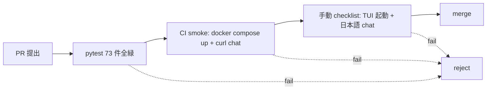

# Polyclaw リファクタリング計画

このディレクトリは polyclaw-jp の構造改善計画と現状分析を記録する。
2026-05-30 開始の **(C+D) 認証パイプライン + 設定管理一貫性** 改善プロジェクトのドキュメント基盤。

## ガバナンス原則

「動作に影響を出さないリファクタリング」を最優先設計とする。守るべき 5 原則:

| # | 原則 | 具体例 |
|---|---|---|
| 1 | **Behavior-preserving (Fowler)** | 外部 API surface (env 変数名 / HTTP route / .env key / CLI flag) は不変 |
| 2 | **Strangler Fig パターン** | 旧コード残存 + 新コード並行配置 + feature flag 切替 + deprecation period |
| 3 | **PR 1 本 = 1 関心事** | リファクタ専念 PR と機能追加 PR を絶対混ぜない |
| 4 | **後方互換徹底** | 既存 `.env` / 既存 SP credential / 既存 Web UI 操作はすべて動き続ける |
| 5 | **回帰検証の機械化** | 手動 smoke (TUI + chat + LLM 応答) を CI 自動化、PR ごとに gating |

## 計画フェーズ (RC-1 〜 RC-9)

| Phase | 内容 | 動作リスク | 状態 |
|---|---|---|---|
| **RC-1** | 現状マップ作成 (本ドキュメント群) | 🟢 ゼロ | 進行中 |
| **RC-2** | dead code 削除 (`ui/app.ts` + `screens/*` 9 ファイル, 約 1500-2000 行) | 🟢 ゼロ | 未着手 |
| **RC-3** | `Settings` の dataclass + frozen 化 (内部のみ、env 名不変) | 🟢 極小 | 未着手 |
| **RC-4** | 新 `ConfigStore` を追加 (旧と並行存在、旧 default) | 🟢 ゼロ | 未着手 |
| **RC-5** | `POLYCLAW_CONFIG_V2=1` feature flag で新モデル opt-in | 🟢 ゼロ (default off) | 未着手 |
| **RC-6** | `AuthProvider` 抽象化 (SP/BYOK/OAuth を統一 interface に) | 🟡 中 | 未着手 |
| **RC-7** | Setup wizard UI 刷新 (バックエンド v1/v2 両対応のまま) | 🟢 極小 | 未着手 |
| **RC-8** | 旧 API を deprecated mark + warning log | 🟢 極小 | 未着手 |
| **RC-9** | deprecation period (1-2 月) 後に旧 API 削除 | 🟡 中 | 未着手 |

**特徴**: RC-1 〜 RC-5 はすべて「default off」または「内部のみ」で動作影響ゼロ。RC-6 〜 RC-7 が本丸だが feature flag で旧 default 維持。RC-9 まで「polyclaw-jp が動作しなくなる瞬間」は存在しない。

## ドキュメント構成

- `README.md` (本ファイル) — 全体計画と進捗管理
- `config-model.md` — 現状の設定モデル分析 (Settings / .env / Web UI / Setup wizard 四層)
- `auth-pipeline.md` — 現状の認証パイプライン分析 (SP / BYOK / OAuth 三層)
- `phase-N-smoke.md` (将来追加) — 各 Phase の作業ログ
- `inventory.md` (将来追加) — 設定キー / 認証ホットスポットの全網羅表

## 検証戦略

各 PR で 3 段階の gating を強制:

- **A**: 既存 pytest + 新規追加 unit test (`Settings` v2 / `AuthProvider` 各実装)
- **B**: GitHub Actions に新ワークフロー追加 — `docker compose up` → 30 秒待機 → `curl POST /chat -d '{"text":"こんにちは"}'` → HTTP 200 + 日本語応答取得を assert
- **C**: PR 説明に smoke checklist をテンプレ化 (2026-05-30 セッションのステップを 4-5 項目に整理)

## アンチパターン (絶対避ける)

| ❌ アンチパターン | なぜダメ | 代替 |
|---|---|---|
| `Settings` の env 変数名を改名 | 既存 `.env` / docker-compose / CI が全部壊れる | 内部 alias 追加、env 名は据置 |
| `/data/.env` のフォーマット変更 | 既存ユーザの設定が読めなくなる | 新 store を別ファイル (`/data/config.json`) に保存 |
| `_byok` 判定ロジックの破壊的変更 | 既存 BYOK / SP / OAuth ユーザが急に動かなくなる | `AuthProvider` 追加時も旧分岐維持 (feature flag) |
| 1 PR で複数 Phase を混ぜる | 何が原因で壊れたか追跡不能、rollback 困難 | 必ず Phase ごと 1 PR |
| smoke test なしで merge | 「動くつもり」が地雷化 | CI smoke 自動化 (RC-1 と並行で整備) |

## 進捗ログ

- **2026-05-30**: RC-1 開始。`config-model.md` と `auth-pipeline.md` 初版作成。
