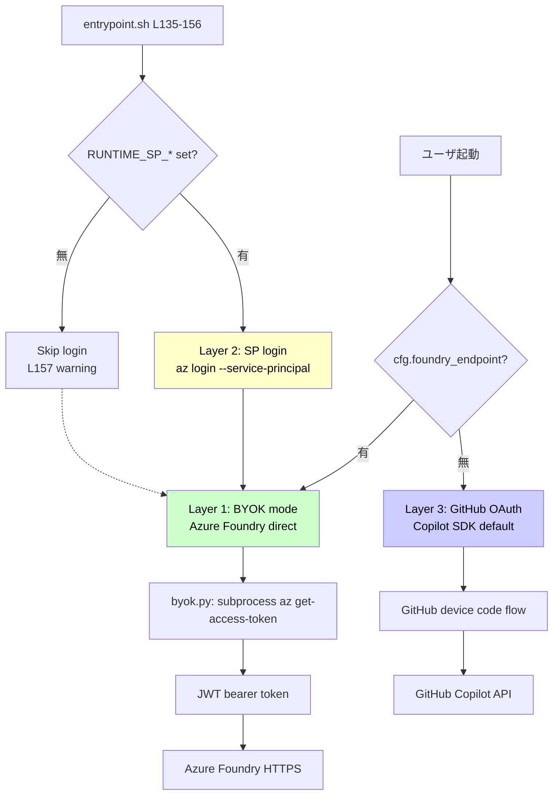

# 認証パイプラインの現状分析

> RC-1 成果物。**現状把握のみ**。改善案は RC-6 で議論。

## エグゼクティブサマリ

polyclaw の LLM 認証は **3 つの方式** を選択可能だが、**選択ロジックが暗黙的** (環境変数の有無で勝手に分岐) で、ユーザがどれを使うべきか / 使えるかを判断する明示的 UI がない。

## 三方式の概要



## Layer 1: BYOK mode (Bring Your Own Key / Azure Foundry direct)

| 項目 | 内容 |
|---|---|
| 判定 | `agent.py:71` `self._byok = bool(cfg.foundry_endpoint)` |
| token 取得 | `byok.py:get_bearer_token()` → `subprocess.run(["az", "account", "get-access-token", "--resource", "https://cognitiveservices.azure.com"])` |
| 認証成立 | `agent.py:145-146` BYOK モードなら GitHub auth skip して `_authenticated = True` |
| provider 構築 | `agent.py:511-521` で BYOK provider 注入: `{type: "azure", bearer_token, api_version: "2024-10-21"}` |
| 必要権限 | Foundry endpoint に対する `Cognitive Services User` (or `Cognitive Services OpenAI User`) |

### 前提条件

- runtime container 内で `az login` 済 (SP or user delegation のどちらか)
- `az` CLI が container に install されている (Dockerfile で導入済)
- `AZURE_CONFIG_DIR` が credential 含む directory を指す

### 障壁 (本日 R2-pure 経験)

- runtime container が container-private な az credential を持つ必要
- 標準では SP credential のみが想定 (Layer 2 経由)
- user delegation credential を runtime に持ち込む方法が公式にはない
  - **回避策**: ホスト `~/.azure` を runtime container に `docker cp` (本日採用、毎回必要)
  - **回避策**: bind mount (host 汚染リスクあり、rubber-duck 警告)
  - **本道**: SP provision (Layer 2)、ただし admin 権限要

## Layer 2: SP login (Service Principal via entrypoint)

| 項目 | 内容 |
|---|---|
| ファイル | `entrypoint.sh` L135-156 |
| 必要 env | `RUNTIME_SP_APP_ID`, `RUNTIME_SP_PASSWORD`, `RUNTIME_SP_TENANT` |
| 実行コマンド | `az login --service-principal --username $APP_ID --password $PASSWORD --tenant $TENANT` |
| 再試行 | 最大 3 回 (`MAX_START_RETRIES`) |
| 失敗時 | L157 で warning「Runtime: no identity credentials found」を log して続行 (但し BYOK は機能しない) |

### 前提条件

- admin の Setup wizard が SP を Azure 上に作成
- credential を `/data/.env` に書き込む (KV 推奨で `@kv:` prefix)
- runtime restart で entrypoint が pickup

### 障壁

- ユーザに Azure subscription level の admin 権限が必要 (SP 作成)
- 個人開発者 (例: 本日のユーザ @shinyay) は MCAPS 配下で SP 作成不可 → Layer 2 完全 block

## Layer 3: GitHub OAuth (Copilot SDK default)

| 項目 | 内容 |
|---|---|
| 判定 | `_byok = False` (FOUNDRY_ENDPOINT 未設定) のとき自動採用 |
| フロー | GitHub device code flow (推定) |
| 認証成立 | GitHub Copilot API への OAuth token を取得 |
| プロバイダ | GitHub Copilot バックエンド (Azure OpenAI ではない) |

### 前提条件

- ユーザに GitHub Copilot サブスクリプション
- ブラウザ経由で device code 完了が可能

### 障壁

- non-IDE 環境 (Docker container) では device code を別画面で完了する必要
- TUI 上でブラウザ起動の指示と URL 表示が必要 → UX 摩擦
- 本セッションでは Layer 3 経路は実際には未検証

## 分岐の暗黙性: 「どれを使っているか」がユーザに見えない

```
ユーザの環境設定状況:
  ├─ FOUNDRY_ENDPOINT 設定済          → BYOK (要 az credential)
  ├─ RUNTIME_SP_* 設定済               → SP credential 経由で BYOK 成立
  └─ どちらもなし                       → GitHub OAuth
```

ユーザは「自分がどの方式を選んだ」という意識を持たないまま起動する。
- Setup wizard を完走した → SP + Layer 1
- .env に FOUNDRY_ENDPOINT だけ書いた → user delegation + Layer 1
- 何もしない → Layer 3 (GitHub OAuth)

問題: **失敗時のエラーメッセージが「認証されていません」だけ** (本セッションで PR-5.0.1 として日本語化済) で、「どの認証経路で失敗したか」「次に何をすべきか」が見えない。

## ホットスポット (触ると壊れやすい)

| 場所 | リスク | 注意 |
|---|---|---|
| `agent.py:71` `_byok = bool(cfg.foundry_endpoint)` | 認証分岐の根幹 | feature flag で wrap、旧分岐維持 |
| `entrypoint.sh L135-156` SP login retry | 起動失敗で container crash | retry 数据据置、log のみ改善 |
| `byok.py:get_bearer_token()` | subprocess の env 継承 | env=os.environ.copy() を明示化推奨 |
| `agent.py:145-146` BYOK auth skip | 認証成立フラグ | 認証 provider 抽象化後にここを generalize |
| `/data/.env` の read/write | データ完全性 | upsert API を library 化 |

## 課題リスト (RC-6 で対処)

| # | 課題 | 影響 | 対処 |
|---|---|---|---|
| A-01 | 三方式が暗黙的に分岐、ユーザが認識できない | UX | `AuthProvider` interface + 明示的選択 UI |
| A-02 | エラーメッセージが「認証されていません」だけ | UX | 認証 provider 別の詳細エラー |
| A-03 | runtime container への az credential 持ち込み手段が SP 専用 | DX | user delegation 経由を公式サポート |
| A-04 | Setup wizard を完走しなくても認証成立可能なはずだが UI 上分かりにくい | UX | 「lightweight setup」モード追加 |
| A-05 | Layer 3 (GitHub OAuth) が non-IDE で UX 摩擦 | UX | TUI 内 device code 表示 + ブラウザ起動誘導 |
| A-06 | `byok.py` の subprocess が env 継承に暗黙依存 | 信頼性 | env=os.environ.copy() 明示 + `AZURE_CONFIG_DIR` 必須 check |
| A-07 | BYOK token の expiration 管理がない (毎回取得) | 性能 | token cache (in-memory, expires_on 監視) |

## 改善方向 (RC-6 で議論)

`AuthProvider` 抽象化:

```python
class AuthProvider(Protocol):
    """LLM 呼び出しに必要な認証 token / config を返す統一 interface."""

    name: str  # "byok-user", "byok-sp", "github-oauth"

    async def acquire_credentials(self) -> AuthResult:
        """token 取得 (失敗時は AuthError)."""

    async def check_prerequisites(self) -> PreflightResult:
        """必要前提条件 (az login済 / SP credentials / GitHub session) の事前 check."""

    def provider_config(self) -> dict:
        """Copilot SDK に渡す provider 設定."""
```

実装:
- `ByokUserDelegationProvider` (user az login 経由)
- `ByokServicePrincipalProvider` (SP 経由、既存 entrypoint.sh ロジックを Python 側へ)
- `GitHubOAuthProvider` (Copilot SDK default)

Setup wizard で明示的に選択 + フォールバック順序を設定可能。各 provider が `check_prerequisites()` で前提条件チェックし、Setup wizard で結果表示。

## 参考: 本日 (2026-05-30) の体感事例

「polyclaw-jp で日本語 LLM 応答」目標達成のために:

1. SP provision (Layer 2) はユーザ admin 権限ない → 拒否
2. user delegation を runtime に持ち込む必要 → 公式手段なし
3. R2-pure (`docker cp ~/.azure → /runtime-home/.azure`) を採用
4. `/data/.env` に `FOUNDRY_ENDPOINT` 手動投入 (Layer 1 起動)
5. 動作確認: BYOK provider 注入成功、日本語応答取得 ✅

毎回 container 再作成のたびに 3-4 を再実行する必要 → 持続可能ではない。
